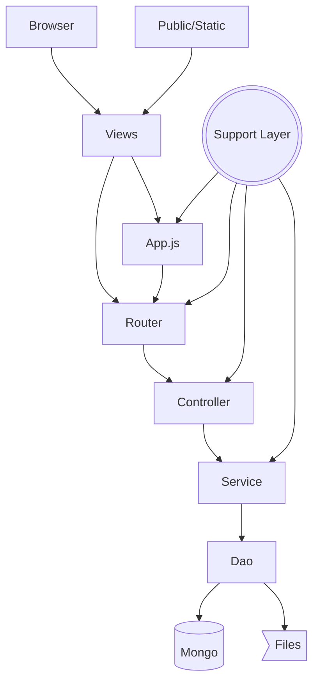

# Curso Backend Coderhouse

Este proyecto sirve como repositorio de las entregas semanales del curso de Programacion Backend de Coderhouse.

## Sobre el curso
Curso iniciado el primer cuatrimestre del 2023.

### Que es Backend?

El BackEnd comprende toda la parte lógica y de manejo de información. Es decir, la base lógica de nuestra página o aplicación. El usuario NO sabe lo que hay detrás.
* El almacenamiento de información
* Los cálculos complejos
* Los servidores donde viven las páginas
* Manejo de información en general

### Express
La libreria express nos permite montar de forma rapida y sencilla un servidor con los endpoints que necesitemos.

### Router
Un router en express nos permitirá separar los endpoints “comunes” en entidades separadas que fungirán como “mini aplicaciones”, las cuales tomarán peticiones que concuerden con dicho endpoint y así redireccionarse a esta mini aplicación.

### Websocket

Websocket es un protocolo de comunicación basado en TCP para poder establecer esa conexión entre el cliente y el servidor. A diferencia de HTTP la comunicacion es bidireccional con la utilizacion de endpoints(Sockets) que emiten y reciben informacion.

### Arquitecturas por Capas
Cuando trabajamos con capas, entendemos que cada archivo debe cumplir una función específica, permitiendo así que, si llegase a ocurrir algún comportamiento no esperado o si llegase a requerirse modificación en algún punto, tengamos claro dónde debemos efectuar esos cambios.

En este modelo contamos con 3 capas base:
 * La capa de Modelo o Persistencia
 * La capa de Controlador o Negocio
 * La capa de Vista o Renderizacion

## Entrega Actual 
La entrega actual corresponde a la clase 30.

## Contenido - Practica Integradora

* Clases - (Product y cartManager)
* Persistencia de datos en Archivos - (Libreria fs)
* Express - Modelo Request-Response (Uso de Server y Render en app.js)
* Router y Middleware - (Carpeta Routes)
* Libreria path y  funcion fileURLToPath - Posicion Relativa a carpeta de ejecucion.
* Uso de Postman - (Carpeta Postman con proyecto Coleccion de Test).
* Plantillas con Handlebars - (En app.js se configuran las vistas de la carpeta views)
* WebSockets - (En app.js se utilizan sockets para comunicarse con realtimeproducts.js)
* MongoDB - CRUD en bases de datos no relacionales
* Mongoose - conexion de Node con MongoDB Atlas
* Patron DAO - objeto de acceso a datos - Managers(clases) y Models(Esquemas)
* Autenticacion/Login - Session
* Authorisation - Perfiles y Estrategia de autorizacion con Libreria Passport
* Perfiles con actividad diferenciada
* Encriptacion de Password - bcrypt
* Variables de Entorno - Enviroment
* Estructura de Capas - Capa de Persistencia,Capa de Negocio y Capa de Vista
* Mailing
* Patron Factory para persistencia de mensajes.
* DTO para validacion de formato de carritos y validacion de datos sensibles de usuario.
* Docker
* Error Handling utilizando generador personalizado de errores y diccionario de errores.
* Mock con faker-js
* Logeo por niveles con Winston
* Valdria la pena usar Artillery para testing de performance?

##  Patrones de diseño
* El patrón DAO 
* Patrón Factory
* Chain of Responsibility
* Decorator
* Proxy
* MVC
* Singleton

## Arquitectura

